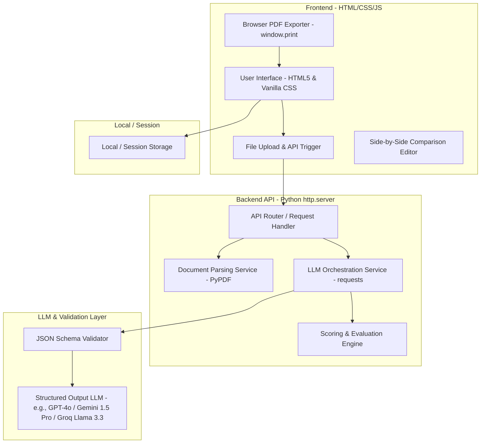
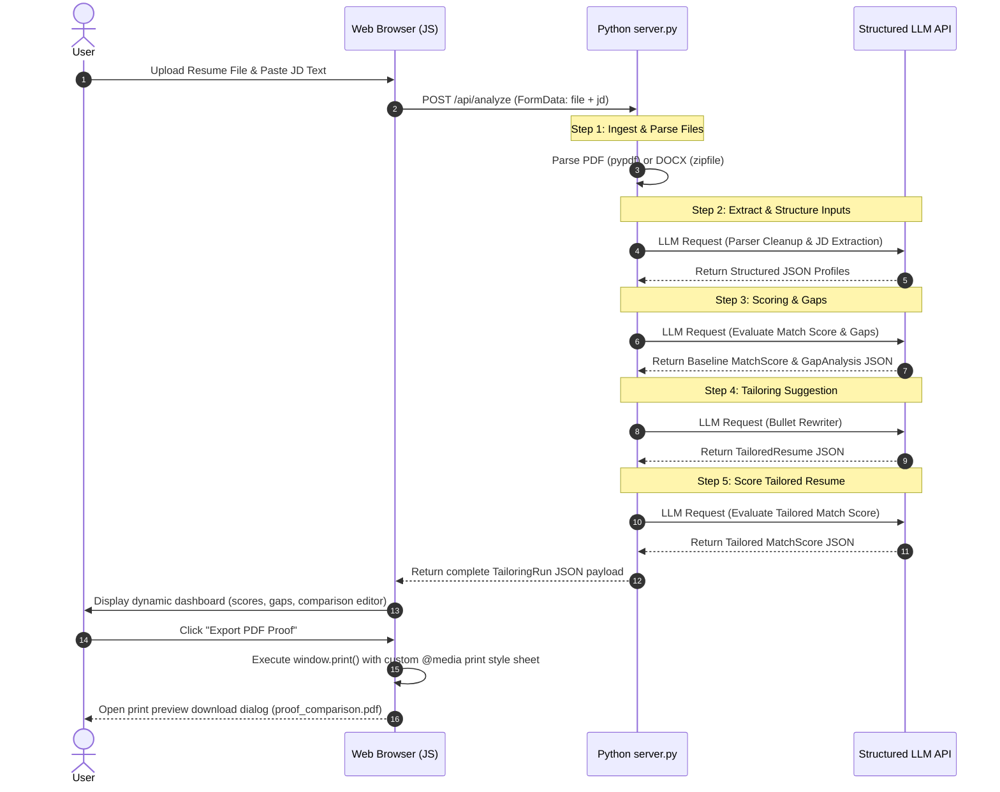

# Resume Shapeshifter — Architectural Design Document

This document outlines the detailed system architecture, data models, processing pipelines, and design considerations for **Resume Shapeshifter**, a JD-to-resume tailoring engine.

---

## 1. System Overview & Architecture

Resume Shapeshifter is designed as a lightweight, resilient web application. Due to the lack of Node.js on the execution platform, it is built on a **Python Backend + Vanilla HTML/CSS/JS Frontend** stack. It ingests an existing resume and a target job description, performs multi-stage LLM analysis to evaluate compatibility, generates a tailored resume preserving original credentials, and outputs structured comparisons and PDF documents.

### High-Level Component Diagram



---

## 2. Core Architectural Principles

1. **Truthfulness Guardrails (Zero-Fabrication Policy)**: The system must enforce that no metrics, skills, certifications, degrees, or employers are fabricated. All modifications must be grounded in the user's input resume.
2. **Deterministic Schemas via Python dict/JSON Validation**: All inputs and outputs between services and LLMs are structured and validated to prevent JSON parsing failures and schema drift.
3. **Decoupled LLM Pipeline (Multi-Prompt Architecture)**: Rather than running a single massive prompt, the application breaks down the evaluation and generation into discrete steps. This improves reasoning, reduces context window overhead, and allows target testing of individual prompts.
4. **Stateless Operations**: The MVP runs entirely in-session (leveraging local storage and stateless API requests).

---

## 3. Subsystem Specifications

### 3.1 Document Parsing Service
* **Responsibility**: Ingests raw files (`.pdf`, `.docx`, `.txt`) and extracts clean, unformatted text.
* **Tech Stack**: `pypdf` (installed via pip) for PDF files, and a zipfile-based XML extractor for `.docx` files to ensure zero complex system dependencies.
* **Output**: A raw string along with basic document metadata.

### 3.2 Job Description (JD) Extractor
* **Responsibility**: Standardizes job postings (raw text or scraped pages) into structured requirements.
* **Input**: Raw text pasted by the user.
* **Output**: A structured `JobDescriptionProfile` JSON object.

### 3.3 LLM Orchestration & Scoring Engine
* **Responsibility**: Manages the step-by-step invocation of the LLM API, injecting correct prompts, enforcing JSON schemas, and measuring semantic matching.
* **Tech Stack**: Uses the Python `requests` library to make raw POST requests directly to the LLM endpoint (e.g. OpenAI GPT-4o or Gemini API), parsing and validating the JSON response.
* **Scoring Rules**:
  * **Required Skills Coverage** (Weight: 35%)
  * **Responsibility Alignment** (Weight: 25%)
  * **Keyword Match** (Weight: 15%)
  * **Seniority / Experience Fit** (Weight: 15%)
  * **Preferred Skills Coverage** (Weight: 10%)
* **Deduction Penalty**: Applying heavy penalties for missing critical requirements (e.g. specialized degrees or minimum years of experience).

### 3.4 Tailoring Engine (Bullet Rewriter)
* **Responsibility**: Takes experience bullets and maps them against JD requirements to generate aligned alternatives.
* **Output Metadata**: For every rewritten bullet, outputs:
  * Original text
  * Tailored text
  * Specific explanation of the rewrite
  * Keywords targeted
  * Confidence level (`high`, `medium`, `low`)
  * Risk flags (if the rewrite could be interpreted as overstating experience)

### 3.5 PDF Generation Service
* **Responsibility**: Compiles the original vs tailored resume, differences, and gap analysis into a print-ready side-by-side comparison document.
* **Tech Stack**: Client-side `@media print` CSS stylesheet with `window.print()` triggered via JS. This enables high-performance, layout-perfect PDF generation directly in the user's browser, eliminating bulky server-side browser dependencies (such as Playwright/Puppeteer binaries).

---

## 4. Data Models & Schemas

The following data models define the interface contracts between the frontend, backend, and LLM APIs.

### 4.1 Resume Profile Schema
```json
{
  "contact": {
    "name": "string",
    "email": "string",
    "phone": "string",
    "location": "string",
    "website": "string"
  },
  "summary": "string",
  "skills": ["string"],
  "experience": [
    {
      "company": "string",
      "title": "string",
      "location": "string",
      "startDate": "string",
      "endDate": "string",
      "bullets": ["string"]
    }
  ],
  "projects": [
    {
      "name": "string",
      "description": "string",
      "bullets": ["string"],
      "technologies": ["string"],
      "url": "string"
    }
  ],
  "education": [
    {
      "institution": "string",
      "degree": "string",
      "fieldOfStudy": "string",
      "graduationDate": "string",
      "gpa": "string"
    }
  ],
  "certifications": [
    {
      "name": "string",
      "issuingOrganization": "string",
      "issueDate": "string",
      "expirationDate": "string"
    }
  ]
}
```

### 4.2 Job Description (JD) Profile Schema
```json
{
  "jobTitle": "string",
  "company": "string",
  "requiredSkills": ["string"],
  "preferredSkills": ["string"],
  "responsibilities": ["string"],
  "qualifications": ["string"],
  "tools": ["string"],
  "keywords": ["string"],
  "seniorityLevel": "Junior | Mid | Senior | Lead/Principal | Management | Executive | Unspecified",
  "domainSignals": ["string"]
}
```

### 4.3 Match Score & Evaluation Schema
```json
{
  "overallScore": 0,
  "skillCoverageScore": 0,
  "responsibilityAlignmentScore": 0,
  "keywordScore": 0,
  "seniorityScore": 0,
  "criticalMissingRequirements": ["string"],
  "explanation": "string"
}
```

### 4.4 Tailored Resume Schema
```json
{
  "tailoredSummary": "string",
  "tailoredSkills": ["string"],
  "tailoredExperience": [
    {
      "company": "string",
      "title": "string",
      "bullets": [
        {
          "original": "string",
          "tailored": "string",
          "changeReason": "string",
          "keywordsAddressed": ["string"],
          "confidence": "high | medium | low",
          "riskFlag": "string"
        }
      ]
    }
  ],
  "tailoredProjects": [
    {
      "name": "string",
      "bullets": [
        {
          "original": "string",
          "tailored": "string",
          "changeReason": "string",
          "keywordsAddressed": ["string"],
          "confidence": "high | medium | low",
          "riskFlag": "string"
        }
      ]
    }
  ]
}
```

### 4.5 Resume Gap Schema
```json
{
  "gaps": [
    {
      "name": "string",
      "importance": "high | medium | low",
      "jdEvidence": "string",
      "resumeEvidence": "string",
      "suggestedAction": "string",
      "canSafelyAdd": false
    }
  ]
}
```

---

## 5. System Data Flow

The following sequence diagram details the end-to-end user request lifecycle:



---

## 6. LLM Orchestration & Prompting Strategy

To guarantee structured outputs, all LLM API invocations (including OpenAI, Google Gemini, and Groq Cloud) enforce structured JSON formats (using `response_format: {"type": "json_object"}` or schema definitions) for each of the following 6 modular prompts. Groq is supported natively via its OpenAI-compatible endpoints using Llama-3.3-70b-versatile.

* **1. Resume Parser Prompt**: Cleans raw text into structural JSON.
* **2. JD Extraction Prompt**: Extracts roles, required/preferred skills, tools, responsibilities, seniority, and keywords.
* **3. Scoring & Match Prompt**: Compares parsed resume with extracted JD to yield scores (overall, skills, responsibility, keywords, seniority) and specific explanations.
* **4. Bullet Rewriting Prompt**: Rewrites bullets to match keywords and responsibilities, adding metadata (confidence, reason, keywords, risk flag).
* **5. Gap Analysis Prompt**: Identifies missing/weak areas, attaches evidence, importance, and suggested actions.
* **6. Final Resume Assembly Prompt**: Assembles the tailored sections into a final structure.

### 6.1 Truthfulness Guardrails
Every prompt sent to the LLM (specifically the bullet rewriter) must append the following system instructions:
```text
SYSTEM GUARDRAIL RULES:
1. DO NOT fabricate any historical information. You must work strictly within the scope of facts provided in the original resume.
2. DO NOT change job titles, dates of employment, degrees, GPA, or company names.
3. DO NOT invent metrics (e.g., changing "Improved performance" to "Improved performance by 47%"). Only refine phrasing if the metric was not explicitly present.
4. If a keyword cannot be truthfully worked into the resume based on the provided text, do not force it. Instead, flag it as a missing gap.
5. If you must estimate or suggest a rewrite that requires verification, set the confidence to "low" and add a clear descriptive warning in the "riskFlag" property.
```

---

## 7. Recommended File & Project Structure

The project structure is organized to cleanly separate prompts, schemas, business logic, and UI elements.

```text
/
├── server.py               # Main Python HTTP Server (runs on localhost:8000)
├── index.html              # Core single-page layout (Semantic HTML5)
├── style.css               # Styling (Vanilla CSS, Glassmorphic Dashboard, Print layout)
├── app.js                  # Frontend Controller (State management, AJAX handlers, UI updates)
├── README.md               # Setup and Running instructions
└── prompts/                # Plain text files containing LLM prompt instructions
    ├── resume_parser.txt
    ├── jd_extraction.txt
    ├── match_scoring.txt
    ├── bullet_rewriter.txt
    ├── gap_analysis.txt
    └── final_assembly.txt
```

---

## 8. Technology Stack Rationale

* **Python Built-in HTTPServer**: Provides a lightweight, dependency-free development server that runs instantly on any machine with Python 3, avoiding any package compilation issues.
* **Vanilla HTML, CSS, and JS**: Guarantees fast load times, is 100% compliant with standard browsers, and has zero dependency on Node package management.
* **Browser-side PDF Generation**: Standardizes document rendering using the browser's own rendering engine via `window.print()`. This allows high-quality, grid-aligned, highlighted comparison PDF outputs without needing complex backend libraries (e.g. Playwright, Weasyprint).
* **Python standard libraries & requests**: Standard `http.server`, `urllib.parse`, and `requests` are used to call the LLM API, ensuring high reliability and simplicity.
